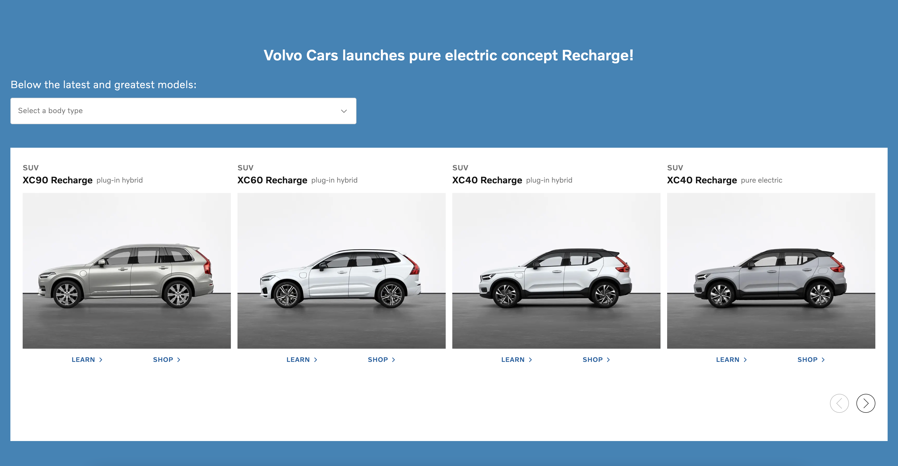

# Volvo Cars (Global Online Digital)

## UI mockups

Our team's designer has come up with a new design to show our latest and greatest recharge cars on the website.

Here is how the design look like for desktop and mobile

### Desktop

[UI Desktop version](./docs/ProductList-Desktop.png)

### Mobile

[UI Mobile version](./docs/ProductList-Mobile.png)

### Data

The data required to render the design is under `public/api/cars.json` folder. You need to fetch the data and render it in the browser. The data looks like this:

```json
[
    {
        "id": "xc90-recharge",
        "modelName": "XC90 Recharge",
        "bodyType": "suv",
        "modelType": "plug-in hybrid",
        "imageUrl": "/images/xc90_recharge.jpg"
    }
]
```

The product owner is telling you that you can generate the links to the learn and shop pages of each car by concatenating the `id` of the car to the learn (`/learn/`) and shop (`/shop/`) urls.

### Requirements

- The project is bootstraped using Next.js.
- Browser support is modern ever-green browsers.
- Implement this design using React and Typescript.
- Accessibility is important.
- Code Structure and reusablity is important.


## Demo

Present a latest and greatest recharge cars.

[Demo](https://volvo-god-frontend-code-test.vercel.app/)




## Prerequisites

You'll need to have either: Node version 16 and above and npm version 7.

## Run project locally

Open a new terminal window and navigate to the folder.
Run `npm install & npm run dev`.
This will install all packages and start the app in localhost:3000

## Deploy

It is deploying automatically using vercel as soon as new commit pushed to this repo

## Technical details

-   The project is built using [Next.js](https://nextjs.org/).
-   Used server-side rendering
-   Frontend implemented using React/Typescript.
-   As system components used a library from Volvo [VCC-UI](https://vcc-ui.vercel.app/)
-   CSS-in-js
-   Prettier
-   Linting
-   Browser support is modern ever-green browsers
-   Support responsive using media queries
-   SEO
-   Accessibility
-   Tested in Lighthouse

## Lighthouse score


## Features:

-   User can have access to the latest Volvo cars
-   User can slide cars ( as a slider I used [Swiperjs](https://swiperjs.com/) )
-   User can filter cars by `bodyType`

### Todo

-   testing UI, components and utils
-   In terms of structure: separate folder for types, absolute paths, 
-   In terms of functionality. For example, add numbers of cars
-   Add database and CRM
