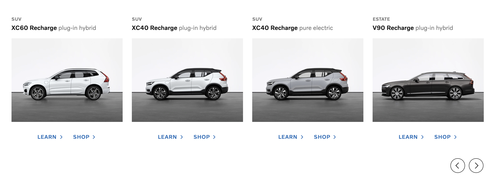

# Volvo Cars (Global Online Digital)

Present a latest and greatest recharge cars.

Here is how the design look like for desktop and mobile

### Desktop



### Mobile


### Data

The data required to render the design is under `public/api/cars.json` folder. You need to fetch the data and render it in the browser. The data looks like this:

```json
[
    {
        "id": "xc90-recharge",
        "modelName": "XC90 Recharge",
        "bodyType": "suv",
        "modelType": "plug-in hybrid",
        "imageUrl": "/images/xc90_recharge.jpg"
    }
]
```

The product owner is telling you that you can generate the links to the learn and shop pages of each car by concatating the `id` of the car to the learn (`/learn/`) and shop (`/shop/`) urls.

## Prerequisites

You'll need to have either: Node version 16 and above and npm version 7.

## To run a project locally

Open a new terminal window and navigate to the folder.
Run `npm install & npm run dev`.
This will install all packages and start the blog in localhost:3000.

## Requirements

-   The project is built using [Next.js](https://nextjs.org/).
-   Browser support is modern ever-green browsers.
-   Frontend implemented using React/Typescript.
-   As system components I use library from Volvo [VCC-UI](https://vcc-ui.vercel.app/)
-   ccs-in-js

## Features:

-   can filter cars by `bodyType`

## Todo

-   testing UI and components
